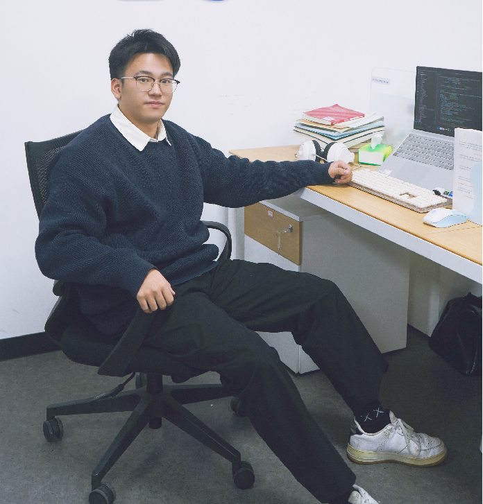

## Hi，大家好！欢迎来到我的Github页面！

## 我是Whale Yu，我的花名是蟹老板!

<!-- https://shields.io/ -->

你是我的第  个访客，谢谢你！你的star是我最大的荣幸!😙

<!-- 
 -->
 

### 🐋个人简介

Whale Yu，金华职业技术学院，人工智能技术应用专业，软件开发工作室人工智能方向核心成员。连续4个学期智育排名第一，制定软开工作室人工智能方向学习路径，带领成员完成50余个项目，持软件著作权9个，获得：
- 第十二届“中国软件杯”大学生软件设计大赛全国总决赛一等奖
- 一带一路暨金砖国家技能发展与技术创新大赛全国一等奖
- 浙江省大学生职业规划大赛金奖
- 第十四届蓝桥杯浙江赛区三等奖

等10余个省级以上奖项。

### 🐟个人经历

- 目前，我是[金职院](https://www.jhc.cn/main.htm)·[信息学院](https://info.jhc.cn/main.htm)的一名大三学生；
- 大一，加入软件开发工作室，自学人工智能，并制定[学习路线](https://docs.qq.com/sheet/DSkRobnVTUGFXYnlq?tab=BB08J2);
- 大二，参加项目开发、各种学科竞赛;
- 现在，已经顺利专升本上岸[湖州学院·计科](https://www.zjhzu.edu.cn/)。

### 🌱 我目前正在做的事情：
- 不断学习AI知识
- 个人网站搭建，集成个人项目
- 个人公众号运营，输出优质内容

### 💪 我挑战自己的事情：
- 早点起床，充分利用这一天
- 每周至少编码 8 小时
- 每周锻炼 3 天
- 通过大学以外的一些教育来完善自己

### 👷项目经历

- 基于yolov5s的老年人跌倒检测并部署到jetson nano 2([项目代码](https://github.com/CrabBoss-lab/fall-detection)，[点我可查看演示视频](https://watch.wave.video/yDDPBm31TQtUWY5j))

- 基于卷积神经网络的垃圾分类系统([项目代码](https://github.com/CrabBoss-lab/garbage-sorting-pytorch)，[点我可查看演示视频1](https://watch.wave.video/yCuWv2MZCPmcQ2Xb)，[点我可查看演示视频2](https://watch.wave.video/dZfyhf9hl3za08Qz))

- 体感交互——基于mediapipe和LSTM的手势估计（[项目代码](https://github.com/CrabBoss-lab/HandPoseEstimationBasedOnMediapipeAndLstm)，[点我可查看演示视频](https://watch.wave.video/32jfVig1l6dt5bkK)）

- 基于 medipipe 和机器学习的动作识别([项目代码](https://github.com/CrabBoss-lab/ActionRecognitionBasedOnMeadipipeAndML)，[点我可查看演示视频](https://watch.wave.video/vHj0dLVwYRohm5yQ))

- 基于resnet18的COVID-19胸部X光识别与预测系统([项目代码](https://github.com/CrabBoss-lab/Covid19-ChestX-ray-prediction)，[点我可查看演示视频](https://watch.wave.video/n3CCzEGgxuWXPnFl))
- ...等等，我不会给你举个例子。

### 📞联系信息

- 🐧QQ Mail: 2933582448@qq.com
- ⚪Cnblogns: [☞点我](https://www.cnblogs.com/xielaoban/)
- 📺Bilibili: [☞点我](https://space.bilibili.com/615998733)
- 🐒CSDN: [☞点我](https://blog.csdn.net/weixin_59605625)

### 🐱Github总结
<!-- 参考程序员鱼皮的github中的样式 -->
<!--  -->

<!-- 
 -->

 

